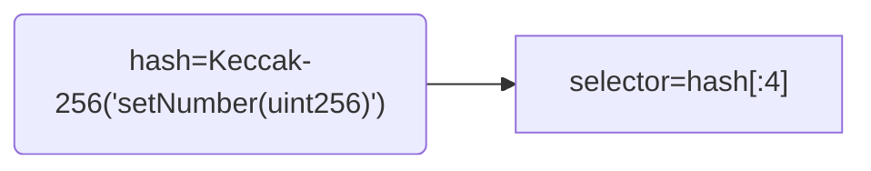

# What is Solidity ABI 

ABI = **Application Binary Interface**.

Smart contract ABIs enable communication and interaction with external apps and other contracts. 


1. Bytecode is not human readable.
2. ABIs can be understood by humans and external apps.
3. Web3 ABI  ==  Web2 API .


 Example online:

1. https://etherscan.io/address/0x838A5832eB19CfCe692809f5b2DE44b15380CDA2#code
2. https://etherscan.io/token/0xdac17f958d2ee523a2206206994597c13d831ec7#code

## How to use ABI

### Generation

1. tooling: Truffle、Hardhat、Foundry、solcjs
2. IDE: Remix

### Specification

doc: https://docs.soliditylang.org/en/v0.8.23/abi-spec.html#json

```json
{
    "inputs": [
      {
        "internalType": "uint256",
        "name": "value",
        "type": "uint256"
      }
    ],
    "name": "setOrGetNumber",
    "outputs": [
      {
        "internalType": "uint256",
        "name": "newNumber",
        "type": "uint256"
      }
    ],
    "stateMutability": "nonpayable",
    "type": "function"
  }
```

#### Function Selector

```
function setNumber(uint256 newNumber) public
```



```
cast keccak "setNumber(uint256)"
0x3fb5c1cb9d57cc981b075ac270f9215e697bc33dacd5ce87319656ebf8fc7b92

cast sig "setNumber(uint256)"
0x3fb5c1cb
```

>  Keccak-256 vs Sha3: 

#### Event

>  event Transfer(address indexed from, address indexed to, uint value);

- `address`: the address of the contract (intrinsically provided by Ethereum);
- `topics[0]`: `keccak(EVENT_NAME+"("+EVENT_ARGS.map(canonical_type_of).join(",")+")")` (`canonical_type_of` is a function that simply returns the canonical type of a given argument, e.g. for `uint indexed foo`, it would return `uint256`). This value is only present in `topics[0]` if the event is not declared as `anonymous`;
- `topics[n]`: `abi_encode(EVENT_INDEXED_ARGS[n - 1])` if the event is not declared as `anonymous` or `abi_encode(EVENT_INDEXED_ARGS[n])` if it is (`EVENT_INDEXED_ARGS` is the series of `EVENT_ARGS` that are indexed);
- `data`: **ABI** encoding of `EVENT_NON_INDEXED_ARGS` (`EVENT_NON_INDEXED_ARGS` is the series of `EVENT_ARGS` that are not indexed, `abi_encode` is the ABI encoding function used for returning a series of typed values from a function, as described above).

### Encode

Signature Database: https://www.4byte.directory/

```solidity
function setNumber(uint256 newNumber) public {
   number = newNumber;
}
```

```
cast abi-encode "setNumber(uint256)" 2023
//0x00000000000000000000000000000000000000000000000000000000000007e7
cast calldata "setNumber(uint256)" 2023 
//0x3fb5c1cb00000000000000000000000000000000000000000000000000000000000007e7
```

```
ABI encode the given function argument, excluding the selector

Usage: cast abi-encode <SIG> [ARGS]...

Arguments:
  <SIG>      The function signature
  [ARGS]...  The arguments of the function
```

How to encode with solidity ❓

Generate JS or ** language files using ABI ❓

### Decode

1. `cast calldata-decode`
2. `cast abi-decode`

how to decode with solidity ❓

## Exercise

Decode data

**Tx1 calldata**

```
0xa9059cbb0000000000000000000000005494befe3ce72a2ca0001fe0ed0c55b42f8c358f000000000000000000000000000000000000000000000000000000000836d54c
```

**Tx2 calldata**

```
0xb24614f2000000000000000000000000dac17f958d2ee523a2206206994597c13d831ec70000000000000000000000007c92b8efbcf4ca58a6d877f35ab78aaa0d3d13bf0000000000000000000000000000000000000000000000000000000017d7840000000000000000000000000000000000000000000000000000000000000000800000000000000000000000000000000000000000000000000000000000000000
```


